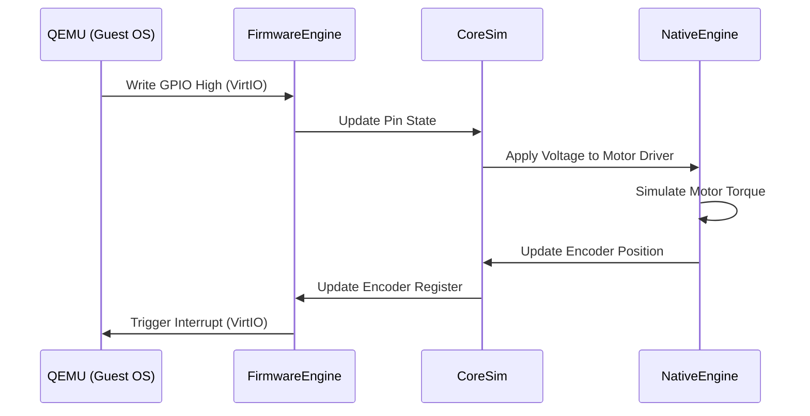

# FirmwareEngine: Hybrid Virtualization Host

**FirmwareEngine** runs the software side of the simulation: microcontroller firmware and (optionally) full Linux images via QEMU. The main focus is deterministic stepping and clear IO/IPC boundaries between “code execution” and the simulated world.

## Dual-Stack Architecture

FirmwareEngine supports two distinct classes of emulation targets:

### 1. Microcontroller Emulation (AVR/STM32)

Used for real-time control boards like Arduino Uno, Mega, and Nano.

- **Technology:** Custom C++ AVR Interpreter (SimAVR based).
- **Accuracy:** Cycle-accurate (executes .hex/.elf binaries directly).
- **Peripherals:**
  - **GPIO:** Digital Read/Write with electrical logic levels.
  - **ADC:** Analog-to-Digital conversion with reference voltage simulation.
  - **Timers:** PWM generation and interrupt triggering.
  - **Comms:** UART, I2C (TWI), SPI.

### 2. Single Board Computer Emulation (ARM64/Linux)

Used for high-level logic, AI, and ROS2 nodes (Raspberry Pi 4/5, Jetson Nano).

- **Technology:** QEMU (Quick Emulator) integration via VirtIO.
- **OS Support:** Runs Linux guest images (e.g., Debian/Ubuntu). “Raspberry Pi OS” compatibility depends on the chosen machine model and guest kernel/device-tree; the product target is an RPi-class experience rather than a guarantee of bit-for-bit Raspberry Pi firmware compatibility.
- **Networking:** Virtual TAP adapter bridges the guest OS to the host network (allows SSH, apt-get, ROS2 discovery).
- **Acceleration:**
  - **NPU:** Emulates Hailo-8 / Coral TPU via host GPU compute shaders.
  - **Camera:** Injects rendered frames from Unity directly into /dev/video0 in the guest Linux.

## Inter-Process Communication (IPC)

FirmwareEngine acts as the bridge between the emulated code and the simulated physical world.



## Supported Boards

| Board              | Architecture     | Emulation Type      | OS/Firmware            | Use Case                |
| :----------------- | :--------------- | :------------------ | :--------------------- | :---------------------- |
| **Arduino Uno**    | AVR (ATmega328P) | Cycle-Accurate      | Bare Metal / Arduino   | Motor Control, Sensors  |
| **Arduino Mega**   | AVR (ATmega2560) | Cycle-Accurate      | Bare Metal / Arduino   | Complex IO, 3D Printers |
| **Raspberry Pi 4** | ARM Cortex-A72   | QEMU Virtualization | Linux (Debian)         | ROS2, Computer Vision   |
| **Raspberry Pi 5** | ARM Cortex-A76   | QEMU Virtualization | Linux (Debian)         | Heavy AI Workloads      |
| **ESP32**          | Xtensa LX6       | QEMU (Experimental) | FreeRTOS / MicroPython | IoT, WiFi/BLE           |

## Virtual Hardware Interfaces

### Camera Injection

RobotWin renders the camera view in Unity/NativeEngine and writes the pixel buffer to a shared memory region. FirmwareEngine exposes this as a V4L2 device inside the Linux guest.

- **Latency:** <1 frame.
- **Format:** RGB888, YUV420.

### Lidar Injection

Simulated Lidar point clouds are injected into the Linux guest as a standard /dev/ttyUSB stream or Ethernet packet stream (Velodyne protocol), allowing standard ROS drivers to consume the data without modification.

## Debugging

- **GDB Stub:** Connect a standard GDB debugger to the emulated chip to step through code, inspect registers, and set breakpoints.
- **Serial Console:** View the boot logs and serial output of the emulated device directly in the RobotWin UI.

## Arduino IDE (Serial Monitor + Upload)

RobotWin supports two Arduino IDE workflows:

- **Serial Monitor (COM port):** Uses a virtual COM pair (com0com) so Arduino IDE can open a COM port and view/send serial text.
- **Upload button (target):** FirmwareEngine can optionally expose an **STK500v1** programmer on a COM port so Arduino IDE can upload sketches without Unity.

### Serial Monitor (Virtual COM)

- Use the RunMode "Virtual COM" tools to install com0com and create a port pair like `COM30<->COM31`.
- Select the **IDE port** (typically the odd-numbered one like `COM31`) in Arduino IDE.

### Upload via Arduino IDE (STK500v1 bridge)

Run the firmware host with an IDE bridge:

```powershell
./builds/firmware/RoboTwinFirmwareHost.exe --ide-com COM31 --ide-board board --ide-profile ArduinoUno
```

Then in Arduino IDE:

- Select `COM31` as the Port.
- Select the matching board (e.g. Arduino Uno).
- Use **Upload**.

Notes:

- This path is intended for AVR boards (Uno/Mega). EEPROM programming is not required for basic sketches.
- RobotWin's native CoreSim pipe transport (`RoboTwin.FirmwareEngine`) still works in parallel; the IDE bridge is an optional extra.
